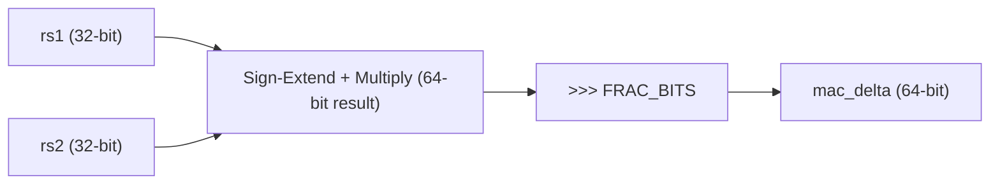
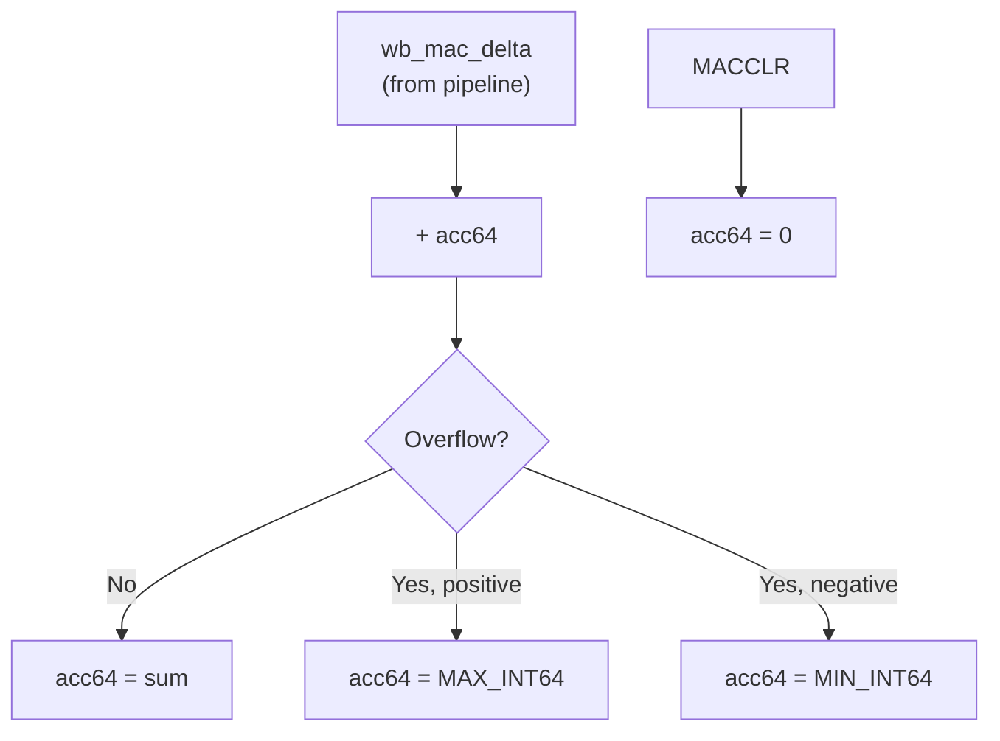
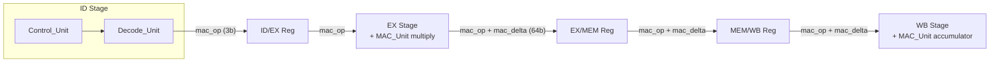

# MAC Unit — Comprehensive Guide

## Table of Contents
1. [What the MAC Unit Does](#1-what-the-mac-unit-does)
2. [Instruction Encoding](#2-instruction-encoding)
3. [MAC_Unit.sv Deep Dive](#3-mac_unitsv-deep-dive)
4. [Testbench Overview](#4-testbench-overview)
5. [Pipeline Integration — All Required Changes](#5-pipeline-integration--all-required-changes)
6. [Vivado Simulation Guide](#6-vivado-simulation-guide)

---

## 1. What the MAC Unit Does

The MAC (Multiply-and-Accumulate) unit computes repeated **fixed-point multiply-accumulate** operations using an internal **64-bit accumulator**:

```
acc64 += (rs1 × rs2) >> FRAC_BITS
```

This accelerates **dot products** and **convolutions** — the core operations in DSP, image processing, and ML inference. Instead of using multiple ALU instructions per multiply-accumulate, a single `MAC` instruction does it in one shot.

### Why 64 bits?

Two 32-bit numbers multiplied produce a 64-bit result. If you accumulate many of these (e.g., a 256-element dot product), the sum can easily overflow 32 bits. A 64-bit accumulator gives headroom. The `MACRDLO`/`MACRDHI` instructions let software read the result in two 32-bit halves.

### Why fixed-point?

Floating-point multipliers are expensive on FPGAs. Fixed-point (Q16.16 by default) uses integer multiply hardware, which is much cheaper and maps directly to the FPGA's DSP slices.

---

## 2. Instruction Encoding

All 4 instructions share the **custom-0** opcode (`7'b0001011`) and are differentiated by `funct3`:

| Instruction | Binary Encoding (32-bit) | Description |
|-------------|--------------------------|-------------|
| `MAC x1, x2` | `0000000_00010_00001_000_00000_0001011` | acc += fx_mul(x1, x2) |
| `MACCLR` | `0000000_00000_00000_001_00000_0001011` | acc = 0 |
| `MACRDLO x10` | `0000000_00000_00000_010_01010_0001011` | x10 = acc[31:0] |
| `MACRDHI x10` | `0000000_00000_00000_011_01010_0001011` | x10 = acc[63:32] |

```
Bit layout (R-type):
 31      25  24  20  19  15  14 12  11   7  6    0
┌─────────┬──────┬──────┬──────┬──────┬────────┐
│ funct7  │ rs2  │ rs1  │ f3   │ rd   │ opcode │
│ 0000000 │ xxxxx│ xxxxx│ xxx  │ xxxxx│0001011 │
└─────────┴──────┴──────┴──────┴──────┴────────┘
```

---

## 3. MAC_Unit.sv Deep Dive


The module has two distinct sections:

### 3.1 EX-Stage: Fixed-Point Multiply (Combinational)



**What happens step by step:**

1. **Sign-extend** both 32-bit inputs to 64 bits (so signed multiplication works correctly)
2. **Multiply** to get a 64-bit product (32×32 fits in 64 bits — no 128-bit intermediate needed)
3. **Arithmetic right-shift** by `FRAC_BITS` (default 16 for Q16.16) to re-normalize the result

**Why the shift?** In Q16.16, the number `0x0001_0000` represents 1.0 (the decimal point is at bit 16). When you multiply two Q16.16 numbers, the product has the decimal point at bit 32 — so you shift right by 16 to put it back at bit 16.

**Example:** 1.0 × 2.0 = `0x10000` × `0x20000` = `0x200000000` → shift right 16 → `0x20000` = 2.0 ✓

This section is **purely combinational** — it runs during the EX stage and the result (`mac_delta`) is captured by the EX/MEM register on the clock edge.

### 3.2 WB-Stage: Saturating Accumulator (Sequential)



**Saturating addition** prevents the accumulator from wrapping around on overflow. Overflow is detected when both operands have the same sign but the result has a different sign:

```
overflow = (acc[63] == delta[63]) && (acc[63] != sum[63])
```

If overflow occurs, the accumulator is clamped to `MAX_INT64` (positive overflow) or `MIN_INT64` (negative overflow).

The accumulator only updates when:
- `wb_valid_i` is asserted (instruction has reached WB and is committed)
- `wb_mac_op_i` is `MAC` or `MACCLR`

`MACRDLO` / `MACRDHI` are read-only — they just expose `acc64[31:0]` and `acc64[63:32]` as combinational outputs.

---

## 4. Testbench Overview

There are two testbenches for the MAC extension:

### 4.1 Isolated Unit Test — `testbench/EX/tb_MAC_Unit.sv`

Directly instantiates `MAC_Unit` and drives its EX/WB ports with tasks. **Compiles and runs without any pipeline integration changes** — useful for verifying the MAC module in isolation.

Tests: reset state, EX multiply correctness, accumulate, clear, negative values, read-only ops don't modify accumulator, `wb_valid=0` gating, `ex_mac_op=NONE` gating.

### 4.2 Pipeline Integration Test — `testbench/tb_RV32I_Core_MAC.sv`

Instantiates the full `RV32I_Core` with IMEM/DMEM models (same pattern as `tb_RV32I_Core_Final.sv`), loads a hand-assembled MAC test program, and checks results by reading DMEM after `EBREAK`.

> [!IMPORTANT]
> This testbench will **not compile** until the pipeline integration changes (Section 5) are applied. The custom-0 opcode will be treated as a NOP by the current `Control_Unit`.

### Pipeline Test Cases

| # | Test | Instructions | Expected result |
|---|------|-------------|-----------------|
| 1 | Accumulator starts at zero | `MACCLR` → `MACRDLO x10` → `sw x10, 0(x0)` | `0x0000_0000` |
| 2 | Single MAC: 1.0 × 2.0 | `MACCLR` → `MAC x1,x2` → `MACRDLO x11` → `sw x11, 4(x0)` | `0x0002_0000` |
| 3 | Accumulate: +3.0 × 4.0 = 14.0 | `MAC x3,x4` → `MACRDLO x12` → `sw x12, 8(x0)` | `0x000E_0000` |
| 4 | Read upper 32 bits | `MACRDHI x13` → `sw x13, 12(x0)` | `0x0000_0000` |
| 5 | Clear and verify | `MACCLR` → `MACRDLO x14` → `sw x14, 16(x0)` | `0x0000_0000` |

Both testbenches include helper functions (`enc_MAC`, `enc_MACCLR`, `enc_MACRDLO`, `enc_MACRDHI`) that build 32-bit instruction words from register numbers following the R-type format.

---

## 5. Pipeline Integration — All Required Changes

This section documents **every modification** needed in existing files to make the MAC unit work. The MAC signals flow through the pipeline like this:



---

### 5.1 `scripts/Def.vh` — Add MAC Constants

**Why:** Every module needs to reference consistent MAC operation codes.

```diff
 `define ALU_SLTU        4'b1001         // Set Less Than, Unsigned
 // 4'b1111 reserved
+
+// -------------------------
+// MAC Operation Codes (3-bit)
+// -------------------------
+`define MAC_OP_NONE    3'b000
+`define MAC_OP_MAC     3'b001
+`define MAC_OP_MACCLR  3'b010
+`define MAC_OP_RDLO    3'b011
+`define MAC_OP_RDHI    3'b100
+
+// Custom-0 opcode for MAC extension
+`define OP_CUSTOM0     7'b0001011
+
+// Fixed-point fractional bits (Q16.16 default)
+`define MAC_FRAC_BITS  16
```

---

### 5.2 `src/ID/Control_Unit.sv` — Decode MAC Instructions

**Why:** The control unit currently doesn't know about the custom-0 opcode. We need it to recognize the 4 MAC instructions and produce the correct control signals.

**Changes needed:**

1. **Add `funct3` input** (currently the CU only takes `opcode`) — needed to differentiate the 4 MAC instructions within custom-0
2. **Add `mac_op` output** (3-bit) — tells downstream stages which MAC operation (or NONE)
3. **Add a case for `7'b0001011`** in the opcode switch

```diff
 module Control_Unit (
     input  logic [6:0] opcode,
+    input  logic [2:0] funct3,      // NEW: needed for MAC sub-decoding
 
     output logic       regwrite,
     ...
-    output logic [2:0] alu_op
+    output logic [2:0] alu_op,
+    output logic [2:0] mac_op       // NEW: MAC operation code
 );
 
     always_comb begin
         ...
         alu_op      = `OP_NOP;
+        mac_op      = `MAC_OP_NONE;
 
         unique case (opcode)
             ...
             7'b0010111: begin ... end     // AUIPC
+
+            7'b0001011: begin             // custom-0 (MAC extension)
+                unique case (funct3)
+                    3'b000: begin
+                        mac_op = `MAC_OP_MAC;       // MAC rs1, rs2
+                    end
+                    3'b001: begin
+                        mac_op = `MAC_OP_MACCLR;    // MACCLR
+                    end
+                    3'b010: begin
+                        mac_op   = `MAC_OP_RDLO;    // MACRDLO rd
+                        regwrite = 1'b1;            // writes to rd
+                    end
+                    3'b011: begin
+                        mac_op   = `MAC_OP_RDHI;    // MACRDHI rd
+                        regwrite = 1'b1;            // writes to rd
+                    end
+                    default: ;
+                endcase
+            end
+
             default: ;
         endcase
     end
```

---

### 5.3 `src/ID/Decode_Unit.sv` — Pass MAC Signal Through

**Why:** The decode unit wraps the control unit. It needs to wire the new `funct3` input to CU and route `mac_op` out to the ID/EX register.

**Changes needed:**

1. **Wire `funct3` to `Control_Unit`** — add `.funct3(funct3)` to the CU instantiation
2. **Add `mac_op_o` output port** (3-bit)
3. **Declare `ctrl_mac_op`** wire from CU
4. **Add `.mac_op(ctrl_mac_op)` to CU instantiation**
5. **In the output `always_comb`**: drive `mac_op_o = ctrl_mac_op` (normal) or `MAC_OP_NONE` (bubble)

```diff
     // Outputs → ID/EX register
     ...
     output logic [2:0]  alu_op_o,
-    output logic        valid_o
+    output logic        valid_o,
+    output logic [2:0]  mac_op_o           // NEW
 );
     ...
+    logic [2:0] ctrl_mac_op;               // NEW
 
     Control_Unit CU (
         .opcode         (opcode),
+        .funct3         (funct3),          // NEW
         .regwrite       (ctrl_regwrite),
         ...
-        .alu_op         (ctrl_alu_op)
+        .alu_op         (ctrl_alu_op),
+        .mac_op         (ctrl_mac_op)      // NEW
     );
     ...
     always_comb begin
         if (bubble) begin
             ...
             alu_op_o        = `OP_NOP;
+            mac_op_o        = `MAC_OP_NONE;    // NEW
         end
         else begin
             ...
             alu_op_o        = ctrl_alu_op;
+            mac_op_o        = ctrl_mac_op;     // NEW
         end
     end
```

---

### 5.4 `src/ID/Hazard_Unit.sv` — MAC Uses rs1/rs2

**Why:** The `MAC` instruction reads `rs1` and `rs2`. The hazard unit needs to know this to stall if there's a data dependency (e.g., a load followed immediately by `MAC` using the loaded register).

**Change:** Add `custom-0` to the opcode case:

```diff
     unique case (opcode_i)
         7'b0110011: begin uses_rs1 = 1'b1; uses_rs2 = 1'b1; end // R-type
         ...
         7'b1100111: begin uses_rs1 = 1'b1;                  end // JALR
+        7'b0001011: begin uses_rs1 = 1'b1; uses_rs2 = 1'b1; end // custom-0 (MAC)
         default:    ;
     endcase
```

> [!NOTE]
> `MACCLR`, `MACRDLO`, `MACRDHI` encode `rs1=x0` and `rs2=x0` in the instruction word, so the hazard unit will see register x0 for those — and since x0 is hardwired to zero and never has a pending write, no false stalls will occur.

---

### 5.5 `src/Interstage/id_ex_reg.sv` — Add `mac_op`

**Why:** The `mac_op` signal must travel from ID to EX to tell the execute stage what MAC operation to perform.

```diff
     // From Decode
     ...
     input  logic [2:0]      alu_op_i,
+    input  logic [2:0]      mac_op_i,       // NEW
 
     // Registered outputs
     ...
     output logic [2:0]  alu_op_o,
+    output logic [2:0]  mac_op_o            // NEW
 );
 
     always_ff @(posedge clk) begin
         if (rst || flush_i) begin
             ...
             alu_op_o        <= `OP_NOP;
+            mac_op_o        <= `MAC_OP_NONE;
         end
         else if (!stall_i) begin
             ...
             alu_op_o        <= valid_i ? alu_op_i : `OP_NOP;
+            mac_op_o        <= valid_i ? mac_op_i : `MAC_OP_NONE;
         end
     end
```

---

### 5.6 `src/EX/Execute Unit.sv` — Instantiate MAC Multiply

**Why:** The EX stage needs to compute `mac_delta` using the MAC_Unit's combinational multiply path.

```diff
     ...
+    // MAC operation from ID/EX
+    input  logic [2:0]  mac_op_i,
+
     // Outputs
     output logic [31:0] alu_out_o,
-    output logic [31:0] store_data_o
+    output logic [31:0] store_data_o,
+    output logic [63:0] mac_delta_o          // NEW: to EX/MEM register
 );
     ...
     // ALU (unchanged)
     EXE_ALU ALU ( ... );
+
+    // MAC multiply (combinational, EX-stage only)
+    MAC_Unit MAC (
+        .clk            (/* not used for EX path, but needed for WB */),
+        .rst            (/* same */),
+        .ex_rs1_val_i   (rs1_fwd),
+        .ex_rs2_val_i   (rs2_fwd),
+        .ex_mac_op_i    (mac_op_i),
+        .ex_mac_delta_o (mac_delta_o),
+        // WB ports are connected at top level, not here
+        .wb_valid_i     (1'b0),
+        .wb_mac_op_i    (`MAC_OP_NONE),
+        .wb_mac_delta_i (64'd0),
+        .acc_lo_o       (),
+        .acc_hi_o       ()
+    );
```

> [!IMPORTANT]
> **Alternative (recommended):** Instead of instantiating MAC_Unit inside Execute_Unit with unused WB ports, instantiate it at the **top level** (`RV32I_core.sv`) and connect the EX multiply inputs/outputs and WB commit inputs separately. This is cleaner — see section 5.9.

---

### 5.7 `src/Interstage/ex_mem_reg.sv` — Add `mac_op` + `mac_delta`

**Why:** Both signals must cross from EX to MEM to be available for WB.

```diff
     input  logic        wb_pc4_sel_i,
+    input  logic [2:0]  mac_op_i,           // NEW
+    input  logic [63:0] mac_delta_i,        // NEW
 
     // Registered outputs
     ...
     output logic        wb_pc4_sel_o,
+    output logic [2:0]  mac_op_o,           // NEW
+    output logic [63:0] mac_delta_o         // NEW
 );
     always_ff @(posedge clk) begin
         if (rst || flush_i) begin
             ...
             wb_pc4_sel_o <= 1'b0;
+            mac_op_o     <= `MAC_OP_NONE;
+            mac_delta_o  <= 64'd0;
         end
         else if (!stall_i) begin
             ...
             wb_pc4_sel_o <= wb_pc4_sel_i & valid_i;
+            mac_op_o     <= valid_i ? mac_op_i : `MAC_OP_NONE;
+            mac_delta_o  <= mac_delta_i;
         end
     end
```

---

### 5.8 `src/Interstage/mem_wb_reg.sv` — Add `mac_op` + `mac_delta`

**Why:** Same signals must reach WB where the accumulator is actually updated.

```diff
     input  logic [31:0] load_data_i,
+    input  logic [2:0]  mac_op_i,           // NEW
+    input  logic [63:0] mac_delta_i,        // NEW
 
     // Registered outputs to WB
     ...
     output logic [31:0] load_data_o,
+    output logic [2:0]  mac_op_o,           // NEW
+    output logic [63:0] mac_delta_o         // NEW
 );
     always_ff @(posedge clk) begin
         if (rst || flush_i) begin
             ...
             load_data_o  <= 32'd0;
+            mac_op_o     <= `MAC_OP_NONE;
+            mac_delta_o  <= 64'd0;
         end
         else if (!stall_i) begin
             ...
             load_data_o  <= load_data_i;
+            mac_op_o     <= mac_op_i;
+            mac_delta_o  <= mac_delta_i;
         end
     end
```

---

### 5.9 `src/WB/WriteBack_Unit.sv` — MAC Result Override

**Why:** When `MACRDLO` or `MACRDHI` reaches WB, the writeback value to the register file must be overridden with the accumulator contents instead of the ALU result. When `MAC` or `MACCLR` reaches WB, register write must be **suppressed** (these only update the internal accumulator).

```diff
     input  logic [31:0] pc4_i,
+    input  logic [2:0]  mac_op_i,           // NEW
+    input  logic [31:0] mac_acc_lo_i,       // NEW: from MAC_Unit
+    input  logic [31:0] mac_acc_hi_i,       // NEW: from MAC_Unit

     ...
     always_comb begin
         ...
         // Data selection: PC+4 > MEM > ALU
         if (wb_pc4_sel_i)
             wb_value_o = pc4_i;
         else if (wb_sel_i)
             wb_value_o = load_data_i;
         else
             wb_value_o = alu_out_i;

+        // MAC overrides
+        if (mac_op_i == `MAC_OP_RDLO)
+            wb_value_o = mac_acc_lo_i;
+        else if (mac_op_i == `MAC_OP_RDHI)
+            wb_value_o = mac_acc_hi_i;

         // Gate regwrite
         wb_regwrite_o = valid_i && regwrite_i && (rd_i != 5'd0)
                      && (wb_pc4_sel_i || !wb_sel_i || load_valid_i);

+        // MAC/MACCLR suppress regwrite (they don't write to the register file)
+        if (mac_op_i == `MAC_OP_MAC || mac_op_i == `MAC_OP_MACCLR)
+            wb_regwrite_o = 1'b0;

         rf_we_o    = wb_regwrite_o;
         rf_waddr_o = rd_i;
         rf_wdata_o = wb_value_o;
     end
```

---

### 5.10 `src/RV32I_core.sv` — Wire Everything Together

**Why:** The top-level module must declare the MAC signals, pass them through all interstage registers, and instantiate the `MAC_Unit`.

**Summary of new signals to declare and wire:**

```systemverilog
// ID stage outputs
logic [2:0]  id_mac_op;

// EX stage (from ID/EX reg)
logic [2:0]  ex_mac_op;
logic [63:0] ex_mac_delta;

// MEM stage (from EX/MEM reg)
logic [2:0]  mem_mac_op;
logic [63:0] mem_mac_delta;

// WB stage (from MEM/WB reg)
logic [2:0]  wb_mac_op;
logic [63:0] wb_mac_delta;

// MAC accumulator outputs
logic [31:0] mac_acc_lo, mac_acc_hi;
```

**MAC_Unit instantiation (at top level, recommended approach):**

```systemverilog
MAC_Unit MAC_UNIT (
    .clk            (clk),
    .rst            (rst),

    // EX-stage multiply (combinational)
    .ex_rs1_val_i   (/* forwarded rs1 from Execute_Unit */),
    .ex_rs2_val_i   (/* forwarded rs2 from Execute_Unit */),
    .ex_mac_op_i    (ex_mac_op),
    .ex_mac_delta_o (ex_mac_delta),

    // WB-stage accumulator commit
    .wb_valid_i     (wb_valid),
    .wb_mac_op_i    (wb_mac_op),
    .wb_mac_delta_i (wb_mac_delta),

    // Accumulator read → WriteBack_Unit
    .acc_lo_o       (mac_acc_lo),
    .acc_hi_o       (mac_acc_hi)
);
```

> [!NOTE]
> If you instantiate the MAC_Unit at top level, you'll need to expose the forwarded `rs1_fwd` and `rs2_fwd` signals from `Execute_Unit` as outputs. Alternatively, instantiate the MAC_Unit inside `Execute_Unit` and bring only `mac_delta` up as an output (as shown in section 5.6), then connect the WB ports at the top level by making the clk/rst/wb ports pass through the Execute_Unit as well. The cleaner approach is top-level instantiation.

**Port additions to existing module instantiations:**

| Instantiation | New ports to add |
|---|---|
| `Decode_Unit DeU` | `.mac_op_o(id_mac_op)` |
| `id_ex_reg ID_EX_REG` | `.mac_op_i(id_mac_op)`, `.mac_op_o(ex_mac_op)` |
| `Execute_Unit ExU` | `.mac_op_i(ex_mac_op)`, `.mac_delta_o(ex_mac_delta)` (if MAC in ExU) |
| `ex_mem_reg EX_MEM_REG` | `.mac_op_i(ex_mac_op)`, `.mac_op_o(mem_mac_op)`, `.mac_delta_i(ex_mac_delta)`, `.mac_delta_o(mem_mac_delta)` |
| `mem_wb_reg MEM_WB_REG` | `.mac_op_i(mem_mac_op)`, `.mac_op_o(wb_mac_op)`, `.mac_delta_i(mem_mac_delta)`, `.mac_delta_o(wb_mac_delta)` |
| `WriteBack_Unit WbU` | `.mac_op_i(wb_mac_op)`, `.mac_acc_lo_i(mac_acc_lo)`, `.mac_acc_hi_i(mac_acc_hi)` |

---

## 6. Vivado Simulation Guide

### Step-by-step: Running the MAC testbench

1. **Open your Vivado project** for the RISC-V CPU

2. **Add the new source file**:
   - Click **Add Sources** → **Add or create design sources**
   - Add `src/EX/MAC_Unit.sv`

3. **Add the testbench**:
   - Click **Add Sources** → **Add or create simulation sources**
   - Add `testbench/EX/tb_MAC_Unit.sv`

4. **Set the simulation top module**:
   - In the **Sources** pane, expand **Simulation Sources** → **sim_1**
   - Right-click `tb_MAC_Unit` → **Set as Top**

5. **Run Behavioral Simulation**:
   - **Flow Navigator** → **Simulation** → **Run Behavioral Simulation**
   - Vivado will compile all sources and launch the simulator

6. **Read the Tcl Console output**:
   - Look for `[PASS]` or `[FAIL]` lines for each test case
   - Final line should read: `ALL TESTS PASSED`

7. **Inspect waveforms** (optional but recommended):
   - In the waveform viewer, find the `MAC_UNIT` instance in the hierarchy
   - Add signals: `acc64`, `ex_mac_delta_o`, `ex_mac_op_i`, `wb_mac_op_i`, `sat_overflow`
   - Add the WB stage signals: `wb_value_o`, `rf_we_o`, `rf_wdata_o`
   - Trace a MAC→MACRDLO instruction sequence through the pipeline

### Regression test: Existing core testbench

After integrating the MAC changes, **always re-run** `tb_RV32I_Core.sv`:

1. Set `tb_RV32I_Core` as simulation top
2. Run Behavioral Simulation
3. Expected output: `PASS: done_o asserted at cycle N. mem[0]=15 mem[4]=18`

If this fails, the MAC changes broke something in the base pipeline — check that all new ports have correct default values on reset/flush.

### Synthesis check

To verify the design is synthesizable on the Artix-7:

1. **Flow Navigator** → **Run Synthesis**
2. Check for errors in the **Messages** tab
3. After synthesis completes, open **Report Utilization** to see the DSP slice and LUT usage added by the MAC multiplier
