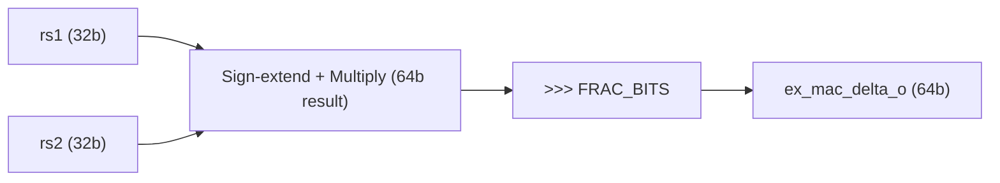
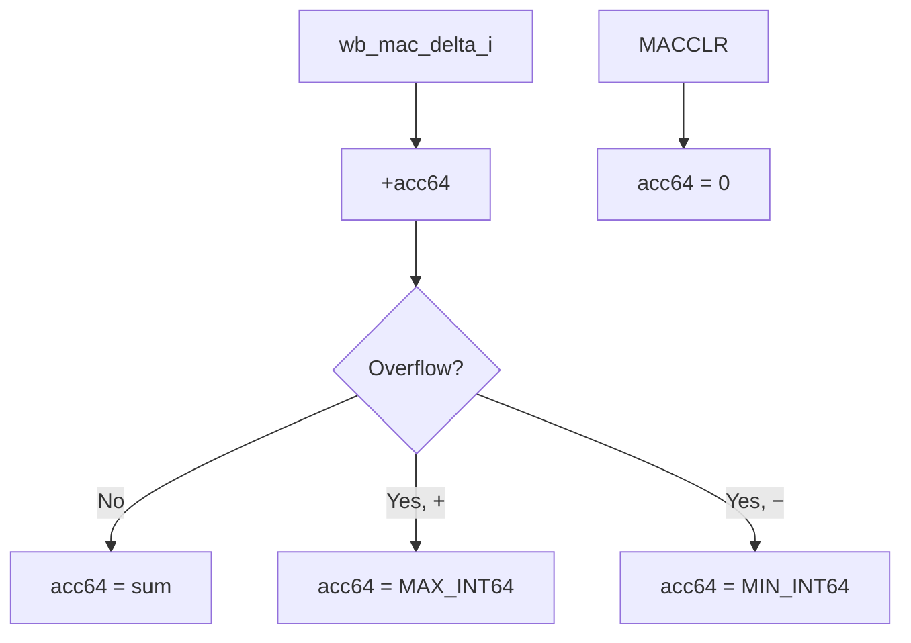

# MAC Unit — Overview & Status

## What It Does

The MAC unit is a **fixed-point multiply-accumulate** accelerator for the RV32I soft-core. It maintains an internal **64-bit signed accumulator** and computes:

```
acc64 += (rs1 × rs2) >>> FRAC_BITS
```

This lets a single instruction do a multiply-accumulate (the core operation for dot products, convolutions, DSP, ML inference) instead of burning multiple ALU instructions. The 64-bit accumulator prevents overflow during long accumulations — software reads the result in two 32-bit halves.

**Fixed-point format:** Q16.16 by default (`FRAC_BITS = 16`). Integer multiply hardware, no floating-point — maps directly to FPGA DSP slices.

---

## The 4 Instructions

All share the **custom-0** opcode (`7'b0001011`), differentiated by `funct3`:

| Instruction | funct3 | Behaviour | Writes to `rd`? |
|---|---|---|---|
| `MAC rs1, rs2` | `000` | `acc64 += fx_mul(rs1, rs2)` | No |
| `MACCLR` | `001` | `acc64 = 0` | No |
| `MACRDLO rd` | `010` | `rd = acc64[31:0]` | **Yes** |
| `MACRDHI rd` | `011` | `rd = acc64[63:32]` | **Yes** |

Encoding is R-type:
```
 31      25  24  20  19  15  14 12  11   7  6    0
┌─────────┬──────┬──────┬──────┬──────┬────────┐
│ funct7  │ rs2  │ rs1  │ f3   │ rd   │ opcode │
│ 0000000 │ xxxxx│ xxxxx│ xxx  │ xxxxx│0001011 │
└─────────┴──────┴──────┴──────┴──────┴────────┘
```

---

## MAC_Unit.sv — Code Walkthrough

**File:** `src/EX/MAC_Unit.sv`

The module splits into two sections:

### Section 1: EX-Stage — Fixed-Point Multiply (Combinational, lines 26–42)



| Step | What happens | Why |
|---|---|---|
| Sign-extend & multiply | `signed 32b → 64b`, then multiply | 32×32 product fits in 64 bits; sign-extension ensures correct signed result |
| Arithmetic shift | `>>> 16` (Q16.16) | Re-normalizes — puts the decimal point back at bit 16 |
| Gate | Zero output if `ex_mac_op_i ≠ MAC` | No spurious deltas for non-MAC instructions |

The result (`ex_mac_delta_o`) is captured by the EX/MEM register on the next clock edge, then carried to WB.

### Section 2: WB-Stage — Saturating Accumulator (Sequential, lines 44–72)



**Saturation logic** (lines 49–53):
```
overflow = (acc[63] == delta[63]) && (acc[63] != sum[63])
```
Both operands same sign but result flipped → clamp to `MAX_INT64` or `MIN_INT64`.

**Accumulator update** (lines 55–72):
- Only fires on `posedge clk` when `wb_valid_i == 1`
- `MAC_OP_MACCLR` → zero the accumulator
- `MAC_OP_MAC` → saturating add
- Everything else → no change (RDLO/RDHI are read-only)

**Read ports** (lines 74–76):
- `acc_lo_o = acc64[31:0]` — combinational, always available
- `acc_hi_o = acc64[63:32]` — combinational, always available

---

## Port Summary

| Port | Direction | Width | Stage | Purpose |
|---|---|---|---|---|
| `clk`, `rst` | in | 1 | — | Clock and reset |
| `ex_rs1_val_i` | in | 32 | EX | Forwarded rs1 value |
| `ex_rs2_val_i` | in | 32 | EX | Forwarded rs2 value |
| `ex_mac_op_i` | in | 3 | EX | MAC op for multiply gating |
| `ex_mac_delta_o` | out | 64 | EX | Multiply result to pipeline |
| `wb_valid_i` | in | 1 | WB | Instruction is committed |
| `wb_mac_op_i` | in | 3 | WB | MAC op for accumulate/clear |
| `wb_mac_delta_i` | in | 64 | WB | Delta from pipeline |
| `acc_lo_o` | out | 32 | WB | Accumulator lower 32 bits |
| `acc_hi_o` | out | 32 | WB | Accumulator upper 32 bits |

---

## Design Choices

| Decision | Choice | Rationale |
|---|---|---|
| **Multiply width** | 64-bit product (not 128) | Inputs are 32-bit sign-extended to 64. A 32×32 multiply produces at most 64 bits, so a 128-bit intermediate wastes LUTs for no benefit. |
| **Accumulator width** | 64-bit | Two 32-bit Q16.16 values multiplied give a 64-bit result. Accumulating many of these (e.g. 256-element dot product) can overflow 32 bits. 64 bits gives headroom. Software reads the halves via `MACRDLO`/`MACRDHI`. |
| **Overflow handling** | Saturating add (clamp to MIN/MAX) | Wrapping would silently corrupt DSP results. Saturation is the standard behavior in DSP hardware — the result is wrong but bounded, which is much easier to detect and debug. |
| **Fixed-point format** | Q16.16, parameterized via `FRAC_BITS` | Good general-purpose split (16 integer + 16 fractional bits). Parameterized so it can be changed at synthesis time without editing RTL. |
| **Accumulator location** | Internal to `MAC_Unit` | Self-contained — one module owns all MAC architectural state. Avoids scattering state across pipeline stages. |
| **Accumulator commit stage** | WB only | Architecturally correct — only retired (committed) instructions update state. If a MAC in EX gets flushed due to a branch mispredict, the accumulator is not corrupted. |
| **Instantiation level** | Top-level (`RV32I_core.sv`) recommended | The MAC_Unit spans two pipeline stages (EX multiply + WB accumulate). Instantiating at top level avoids unused port stubs and makes the dual-stage nature explicit in the hierarchy. |
| **Instruction encoding** | RISC-V custom-0 opcode (`7'b0001011`) | Reserved by the spec for extensions. Using `funct3` to differentiate the 4 operations keeps encoding compact and R-type compatible. |
| **Read ports** | Combinational (not registered) | `acc_lo_o` and `acc_hi_o` are always driven from `acc64`. No extra cycle of latency — the WB mux can read them in the same cycle. |

---

## Current Integration Status

| Item | Status | Notes |
|---|---|---|
| `src/EX/MAC_Unit.sv` | ✅ Done | Module is complete and synthesis-safe |
| `testbench/EX/tb_MAC_Unit.sv` | ✅ Done | Isolated unit test — compiles without integration changes |
| `testbench/tb_RV32I_Core_MAC.sv` | ✅ Done | Pipeline test — requires all integration changes |
| `src/Pseudo/pseudo_mac_extention.txt` | ✅ Done | Pseudocode / design spec |
| `docs/MAC_Integration_Guide.md` | ✅ Done | Full integration guide with diffs |
| `scripts/Def.vh` — MAC constants | ❌ **Not done** | `MAC_OP_*`, `OP_CUSTOM0`, `MAC_FRAC_BITS` need to be added |
| `src/ID/Control_Unit.sv` — decode custom-0 | ❌ **Not done** | Needs `funct3` input + `mac_op` output + case |
| `src/ID/Decode_Unit.sv` — pass mac_op | ❌ **Not done** | Wire `funct3` to CU, route `mac_op_o` |
| `src/ID/Hazard_Unit.sv` — custom-0 uses rs1/rs2 | ❌ **Not done** | One line in opcode case |
| `src/Interstage/id_ex_reg.sv` — carry mac_op | ❌ **Not done** | 3-bit register |
| `src/Interstage/ex_mem_reg.sv` — carry mac_op + mac_delta | ❌ **Not done** | 3-bit + 64-bit registers |
| `src/Interstage/mem_wb_reg.sv` — carry mac_op + mac_delta | ❌ **Not done** | 3-bit + 64-bit registers |
| `src/WB/WriteBack_Unit.sv` — MAC result mux | ❌ **Not done** | Override wb_value, suppress regwrite |
| `src/RV32I_core.sv` — top-level wiring | ❌ **Not done** | Declare signals, instantiate MAC_Unit, connect all ports |

---

## Remaining Work — Detailed Checklist

> [!IMPORTANT]
> All the changes below are documented with full diffs in sections 5.1–5.10 of `docs/MAC_Integration_Guide.md`.

### 1. `scripts/Def.vh` — Add Constants (Guide §5.1)
Add these defines after the ALU op codes:
- `MAC_OP_NONE` / `MAC_OP_MAC` / `MAC_OP_MACCLR` / `MAC_OP_RDLO` / `MAC_OP_RDHI` (3-bit)
- `OP_CUSTOM0` (`7'b0001011`)
- `MAC_FRAC_BITS` (`16`)

### 2. `src/ID/Control_Unit.sv` — Decode MAC (Guide §5.2)
- Add `funct3` input port
- Add `mac_op` output port (3-bit)
- Default `mac_op = MAC_OP_NONE`
- Add `7'b0001011` case that sub-decodes on `funct3`
- `MACRDLO`/`MACRDHI` also set `regwrite = 1`

### 3. `src/ID/Decode_Unit.sv` — Route MAC Signal (Guide §5.3)
- Add `mac_op_o` output
- Wire `funct3` to CU instantiation
- Wire `ctrl_mac_op` from CU → `mac_op_o` (or `MAC_OP_NONE` on bubble)

### 4. `src/ID/Hazard_Unit.sv` — Stall for MAC (Guide §5.4)
- Add `7'b0001011` to opcode case: `uses_rs1 = 1`, `uses_rs2 = 1`
- No false stalls because MACCLR/MACRDLO/MACRDHI encode `rs1=x0, rs2=x0`

### 5. `src/Interstage/id_ex_reg.sv` — Pipeline Register (Guide §5.5)
- Add `mac_op_i` / `mac_op_o` (3-bit)
- Reset/flush → `MAC_OP_NONE`; normal → pass through (gated by `valid_i`)

### 6. `src/Interstage/ex_mem_reg.sv` — Pipeline Register (Guide §5.7)
- Add `mac_op_i/o` (3-bit) + `mac_delta_i/o` (64-bit)
- Reset/flush → zero; normal → pass through

### 7. `src/Interstage/mem_wb_reg.sv` — Pipeline Register (Guide §5.8)
- Same as above: `mac_op` + `mac_delta`

### 8. `src/WB/WriteBack_Unit.sv` — Result Override (Guide §5.9)
- Add `mac_op_i`, `mac_acc_lo_i`, `mac_acc_hi_i` inputs
- If `MACRDLO` → `wb_value = mac_acc_lo`
- If `MACRDHI` → `wb_value = mac_acc_hi`
- If `MAC` or `MACCLR` → suppress `regwrite`

### 9. `src/RV32I_core.sv` — Top-Level Wiring (Guide §5.10)
- Declare `id_mac_op`, `ex_mac_op/delta`, `mem_mac_op/delta`, `wb_mac_op/delta`, `mac_acc_lo/hi`
- Instantiate `MAC_Unit` at top level (recommended over embedding in Execute_Unit)
- Connect EX inputs (forwarded rs1/rs2) and WB inputs (valid, mac_op, mac_delta)
- Add `.mac_op_*` / `.mac_delta_*` ports to all interstage registers and units

---

## Signal Flow Through Pipeline

```mermaid
graph LR
    subgraph ID["ID Stage"]
        CU["Control_Unit"] -->|mac_op| DU["Decode_Unit"]
    end
    DU -->|"mac_op (3b)"| IDEX["id_ex_reg"]
    IDEX -->|mac_op| EX["EX Stage"]
    EX -->|"mac_op + mac_delta (64b)"| EXMEM["ex_mem_reg"]
    EXMEM -->|"mac_op + mac_delta"| MEMWB["mem_wb_reg"]
    MEMWB -->|"mac_op + mac_delta"| WB["WB Stage"]
    WB -->|"valid + mac_op + mac_delta"| MAC["MAC_Unit accumulator"]
    MAC -->|"acc_lo, acc_hi"| WBU["WriteBack_Unit mux"]
```


